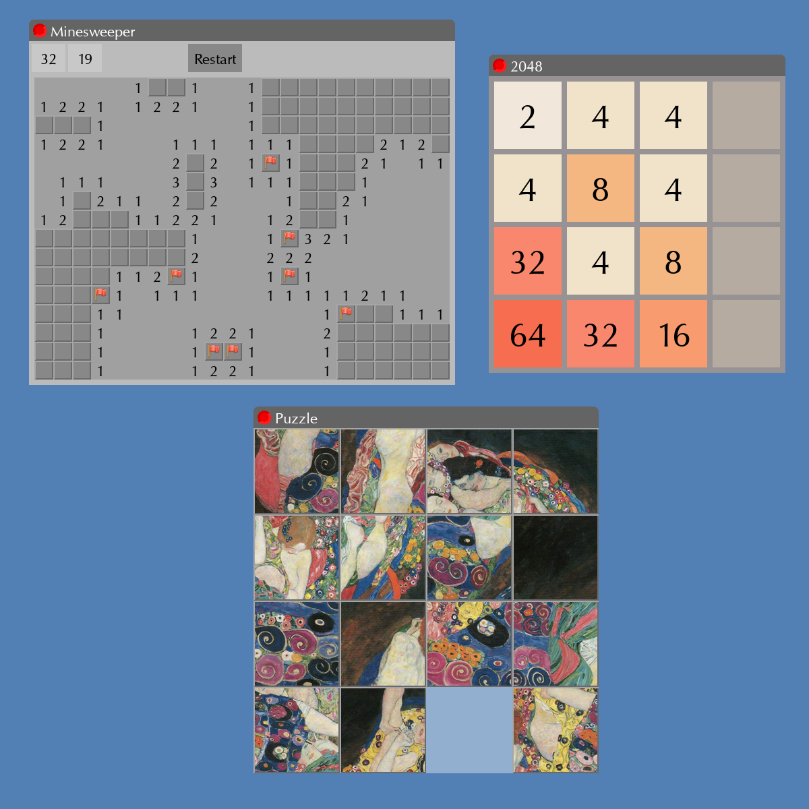
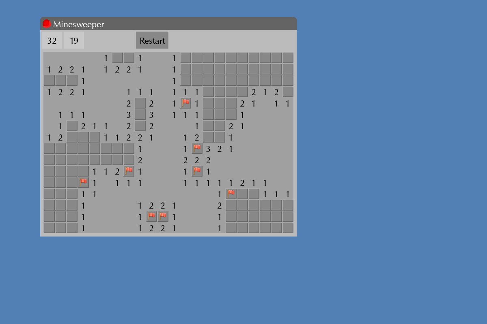
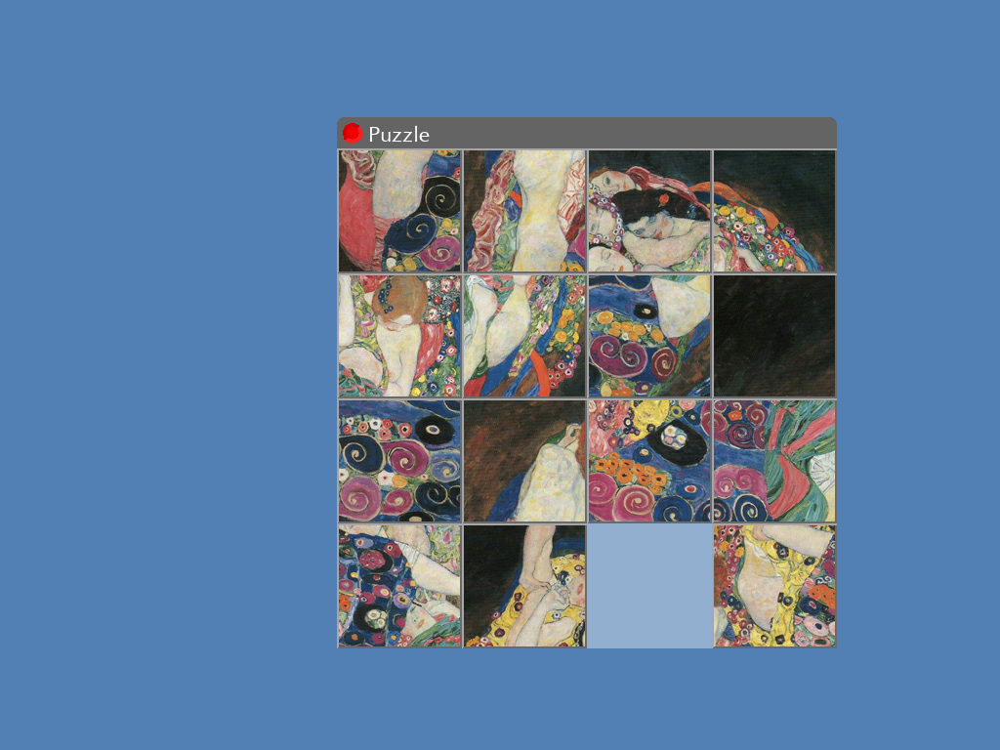
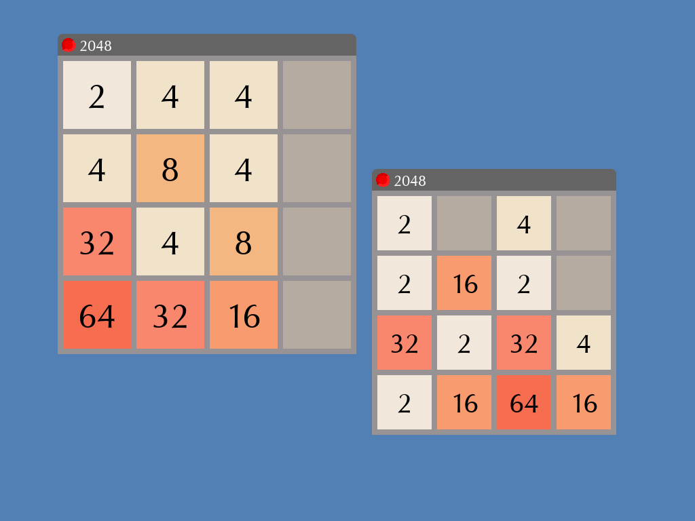

# GUI Project

This repository is the project done at Ensimag. All our code implementations are in the folder implem. The files in the "api" and some of the tests were given and not coded by us. All the files that were not coded by us have in the header the respective credits.



This project focuses on implementing the libei.a library using the provided API. The library allows developers to build custom graphical user interfaces (GUIs) by offering core widget types such as Toplevel, Frame, and Button. It also enables the creation of custom widgets, the registration of button callback functions, and the integration of custom event handlers.

## Project Structure

The structure of the important files are :

```
project/
|-- api/            # API files
|-- docs/           # Documentation doxygen that explains all the functions implemented
|-- implem/         # Source files
|-- misc/           # Assets (images, fonts, etc.)
|-- CMakeList.txt   # CMake build script that defines the rules for compiling the project
|-- README.txt      # Introduction of the project
```

## Features Implemented

-   Drawing of graphic primitives (drawing of lines, polygons)
-   Custom Widget structure and inheritance system
-   3 widget type classes inherited widget class (Toplevel, Frame, Button)
-   Geometry Manager that places a widget and its children at a location
-   Event handling (mouse clicks, key presses, etc)

## Gallery


## How to Compile

The base project archive contains a CMakeLists.txt file. To compile outside of the project's sources, the archive contains an empty cmake directory in which you will compile. For example:

```
cd cmake
cmake ..
make minimal
```

This will generate the executable `minimal`.

However, it's strongly recommended to use an Integrated Development Environment (IDE) like CLion to launch the project as it will help a lot and make the compilation a lot easier.

## How to Run

The compilation will generate an executable file. To run it, just execute this command :

``` bash
./name_of_executable
```

## Dependencies

-   Standard C libraries
-   SDL2

## Build Requirements

-   CMake version 3.20 or later
-   A C compiler (e.g., GCC or Clang)
-   Make (if not using an IDE like CLion)

## Tests

There are several example files provided (e.g., minimal.c, lines.c, button.c, hello_world.c, puzzle.c, minesweeper.c, and two048.c). Some of them are mini games built using the library. These serve as references for how to use the library to create a GUI. To compile and run a specific test, for example minimal.c, run:

``` bash
make minimal
./minimal
```

### minimal

This test fills the root frame with two colors (red on top and white at the bottom), testing the `ei_fill()` function that fills a rectangle with a given color.

### lines

This test draws lines, rectangles, and polygons, and fills them with color, testing `ei_fill()`, `ei_draw_polyline()`, `ei_draw_polygon()`, and the clipping algorithm.

### button

This test displays a clickable button that changes color when clicked and reverts when the cursor leaves, testing button text display, event handling, and callback functions.

### hello_world

This test shows a toplevel window with two buttons (close and clickable), testing widget destruction, dragging, resizing, and optionally bringing a clicked toplevel to the front (with the extra test block to uncomment).

### minesweeper

This test implements the classic Minesweeper game, testing left/right mouse event handling, image manipulation on buttons, and a timer that updates every second.



### puzzle

This test implements the 15 Puzzle game, testing `ei_copy_surface()`, transparent surfaces, moving widgets with children, and keyboard shortcuts (`Ctrl+W` to close, `Ctrl+N` to open a new game).



### two048

This test implements the 2048 game, testing keyboard event handling, window updates after each move, and shortcuts (`Ctrl+W` to close, `Ctrl+N` to open a new game).




### ext_testclass

This test demonstrates adding a new widget type to the library, allowing custom widget extension by the programmer.

## Author

-   **Alexandre Guy**
-   **Tomas Vega Velasquez**
-   **You Chen Koh**

## License

This project is for academic use and demonstration purposes only.
